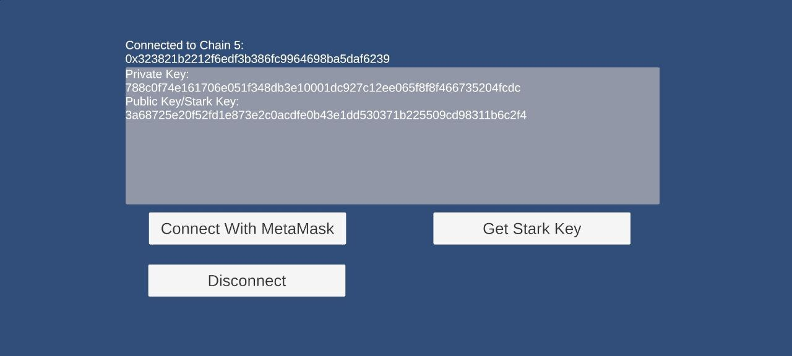
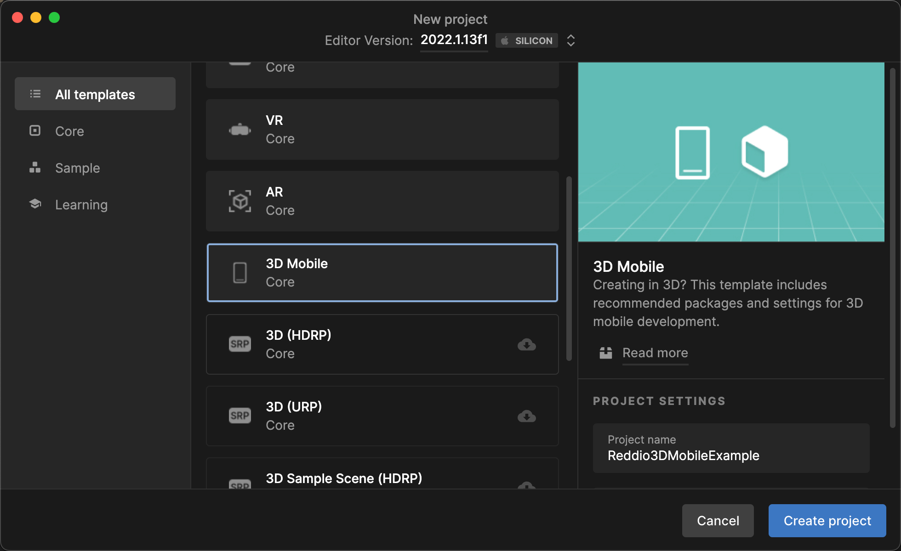
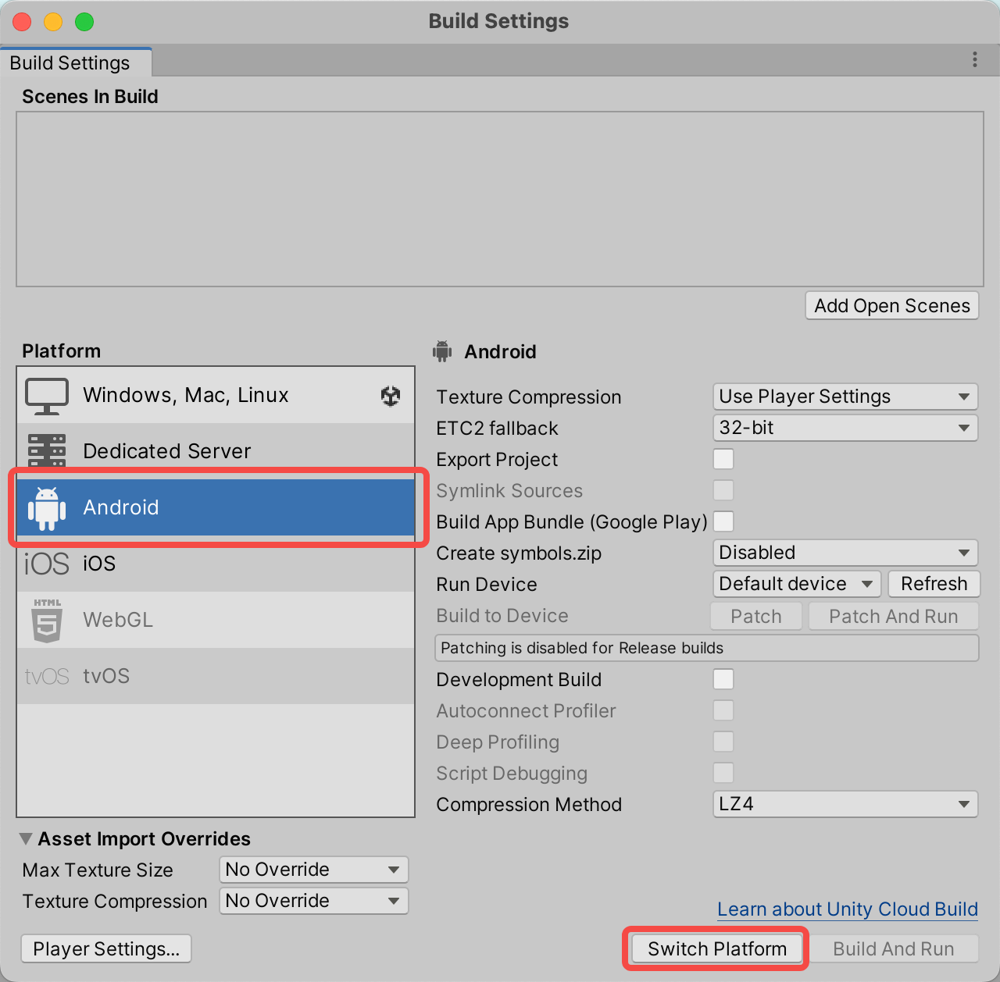
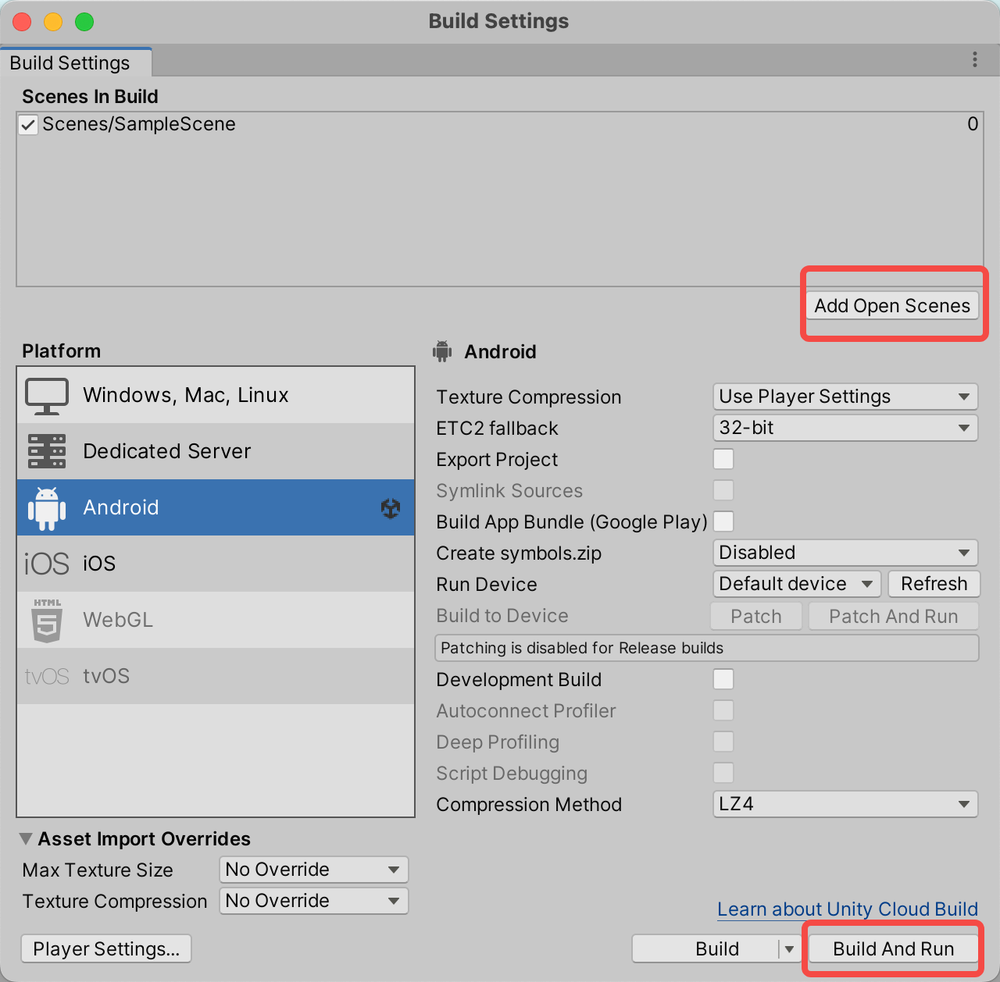
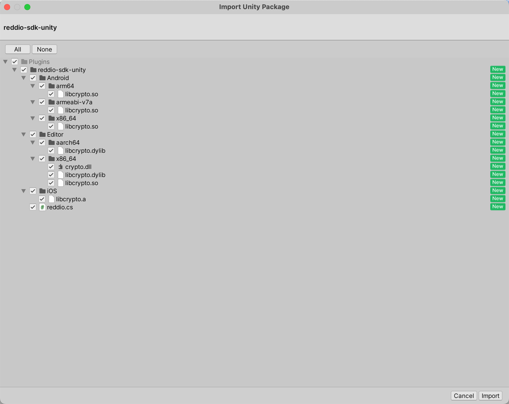
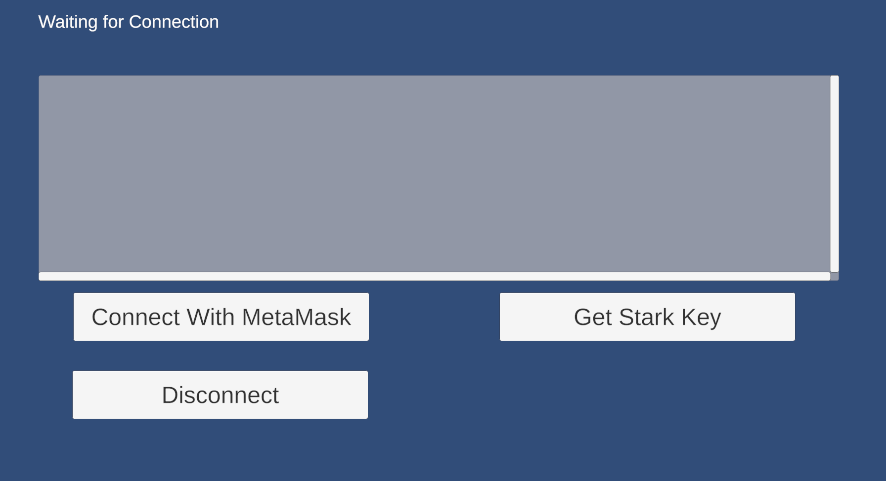

# ReddioSDKUnityExample

## Run the DEMO

This project is build with Unity 2022.1.13f1, and the module "Android Build Support" is also required.

You should use an Android devices or AVD emulator to run the demo, also the app MetaMask should already installed on the device.

You could open this project with Unity Hub, then "build and run" the project with the scene "examples/ReddioSDKUnityExample/Assets/Scenes/ConnectWithMetaMask.unity".

Preview:

## Build Demo from Scratch

### Step 1: Create new Unity Project and new Scene

Create a new project on Unity Hub, with the template "3D Mobile".

Then change the build setting, switch to "Android".

Then add the current Scene into "Scenes In Build", then click "Build And Run".

The application would runs on your Android device which connected with the computer.

### Step 2: Download and Import Plugin reddio-sdk-unity

Download the latest `reddio-sdk-unity.unitypackage` from [Releases](https://github.com/reddio-com/reddio-sdk/releases).

Then import into the current project.

> The `unitypackage` file already contains metadata for static/shared libraries (`.so`/`.dll`/`.dylib`/`.a`) for specifying the platform and architecture, so you don't need to specify them manually. **BUT, you should setup the platform and architecture metadata if you import the library file without using the `unitypackage`, but with `unity-plugin-zip.zip`, or import `.so`/`.dll`/`.dylib`/`.a` directly.**

### Step 3: Integrate with MetaMask

We should integrate with MetaMask to connect with the Ethereum network.

We use [WalletConnect](https://github.com/WalletConnect/WalletConnectUnity) for integrate with MetaMask Mobile, see [README.md#Installation](https://github.com/WalletConnect/WalletConnectUnity) and [README.md#Usage](https://github.com/WalletConnect/WalletConnectUnity#usage) for using it properly.

### Step 4: Write the logic about starkware

At last, a walkthrough about the logic:

There are 3 buttons in the UI canvas:

- "Connect with MetaMask"
- "Get Stark Key"
- "Disconnect"

and 2 text fields:

- The top one would show the account info
- The bottom one with scroll would print the log

Button "Connect with MetaMask" would call `WalletConnect.OpenDeepLink`, ref: <https://github.com/reddio-com/reddio-sdk/blob/b3716f833978109bb66e828c40879e26ea0b1b7a/examples/ReddioSDKUnityExample/Assets/WalletConnectUnity/Scripts/WalletConnectSharp.Unity/WalletConnect.cs#L486>

Button "Get Stark Key" would call `Actions.GetStarkKey`, ref: <https://github.com/reddio-com/reddio-sdk/blob/b3716f833978109bb66e828c40879e26ea0b1b7a/examples/ReddioSDKUnityExample/Assets/Scenes/Actions.cs#L46>

Button "Disconnect" would call `Actions.Disconnect`, ref: <https://github.com/reddio-com/reddio-sdk/blob/b3716f833978109bb66e828c40879e26ea0b1b7a/examples/ReddioSDKUnityExample/Assets/Scenes/Actions.cs#L32>

`Actions.FixedUpdate` would sync the current account info to the top text fields, ref: <https://github.com/reddio-com/reddio-sdk/blob/b3716f833978109bb66e828c40879e26ea0b1b7a/examples/ReddioSDKUnityExample/Assets/Scenes/Actions.cs#L20>
